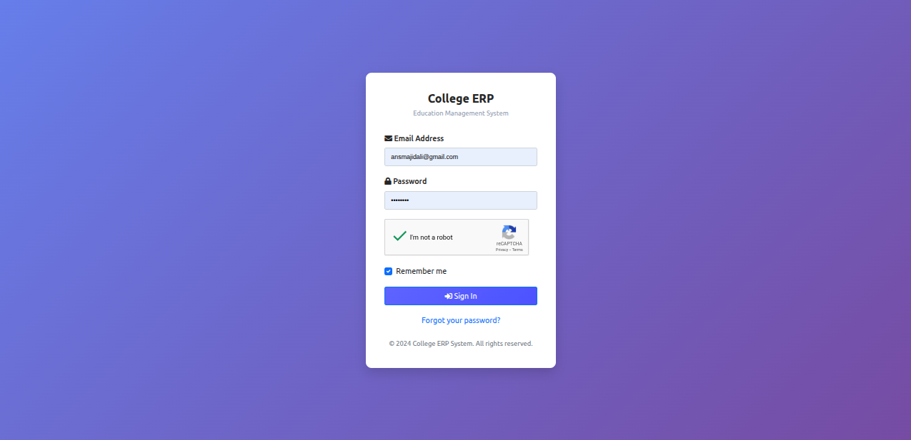
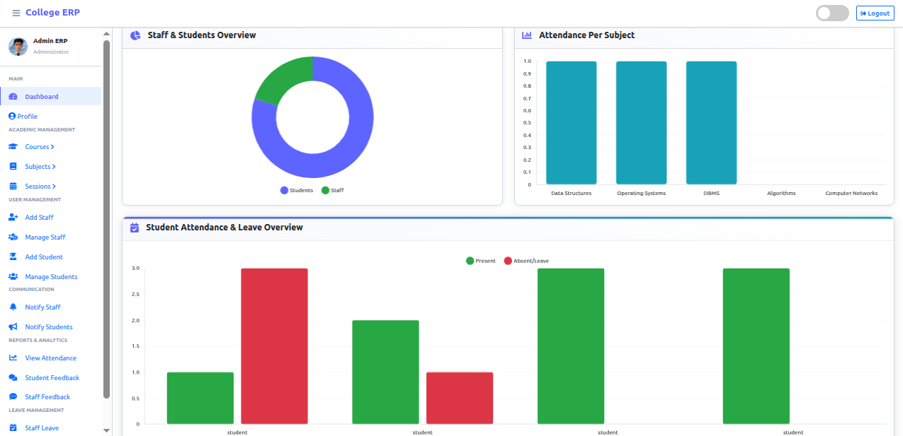
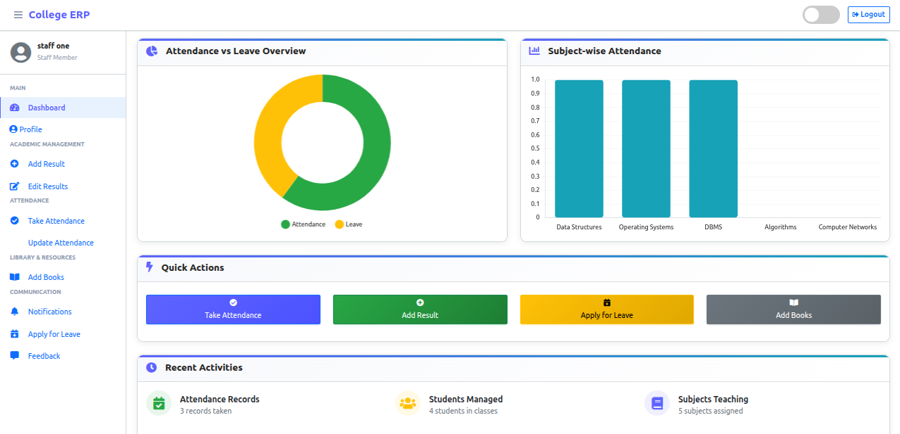

<div align="center">

# 🎓 EduMa — College ERP Management System

### A Full-Stack Enterprise Resource Planning Solution for Educational Institutions

[](https://www.python.org/)
[](https://www.djangoproject.com/)
[](LICENSE)
[](CONTRIBUTING.md)

**EduMa** streamlines everything a college needs to run day-to-day — student records, staff operations, attendance, results, leave management, and feedback — inside one clean, role-based platform.

</div>

---

## 📋 Table of Contents

- [About](#-about)
- [Features](#-features)
- [Tech Stack](#️-tech-stack)
- [Project Structure](#-project-structure)
- [Core Data Models](#-core-data-models)
- [Authentication Flow](#-authentication-flow)
- [Getting Started](#-getting-started)
- [Seeding Test Data](#-seeding-test-data)
- [Demo Credentials](#-demo-credentials)
- [Screenshots](#-screenshots)
- [Roadmap](#️-roadmap)
- [Contributing](#-contributing)
- [Support the Project](#-support-the-project)
- [License](#-license)
- [Contact](#-contact--support)

---

## 🎯 About

**EduMa (College ERP)** is a comprehensive, open-source ERP system built with **Python and Django** for schools, colleges, and universities. It brings students, staff, and administrators onto a single unified platform — replacing scattered spreadsheets and manual paperwork with structured, role-based digital workflows.

Academic structure follows a **Program → Branch → Semester → Subject** hierarchy, so the system can model everything from a single-branch diploma course to a multi-branch B.Tech program with several intakes running in parallel.

### ✨ Why EduMa?

| | |
|---|---|
| 🚀 **Modern Stack** | Built on Django for stability, security, and rapid development |
| 👥 **Multi-Role Architecture** | Dedicated portals for Admin, Staff, and Students |
| 🏛️ **Flexible Academic Structure** | Program → Branch → Semester → Subject, supports Degree and Diploma programs alike |
| 🔒 **Secure by Design** | Role-based access control, custom email authentication |
| 📊 **Data-Driven** | Visual dashboards for attendance, results, and performance |
| 📱 **Responsive** | Fully usable across desktop, tablet, and mobile |
| 🌍 **Open Source** | MIT licensed — free to use, modify, and contribute to |

---

## 🚀 Features

### 👨‍💼 Admin (HOD) Dashboard
- 📈 Analytics overview — student/staff counts, program & subject stats, attendance charts
- 🏛️ Program management (Degree/Diploma, duration, total semesters)
- 🌳 Branch management (linked to a Program)
- 📅 Semester management (linked to Program + Branch)
- 📖 Subject management (linked to a Semester, with theory/practical/internal marks configuration)
- 🧑‍🏫 Subject Allocation — assign a Staff member to a Subject for a given Session
- 🗓️ Academic Session management
- 👥 Full CRUD for staff members
- 🎓 Full CRUD for student records
- ✅ Attendance monitoring across all classes
- 💬 Feedback review from students & staff
- 🏖️ Leave request approval/rejection

### 👨‍🏫 Staff Portal
- 📊 Dashboard scoped to subjects allocated to the logged-in staff member
- ✏️ Mark and update student attendance (by subject + session)
- 📝 Enter and revise examination results (internal / theory / practical marks)
- 🏖️ Apply for personal leave
- 💭 Send feedback directly to admin
- 👤 View profile (read-only) with password-only self-update

### 🎓 Student Portal
- 📊 Personal dashboard — attendance and subject overview
- 📅 Attendance history tracking (by subject and date range)
- 🎯 View examination results (internal / theory / practical / total marks)
- 🏖️ Submit leave requests
- 💬 Send feedback to HOD
- 👤 View profile (read-only) with password-only self-update — academic and personal details are managed by the administration

---

## 🛠️ Tech Stack

| Category | Technologies |
|---|---|
| **Backend** | Python, Django Framework |
| **Frontend** | HTML5, CSS3, JavaScript, Bootstrap, Chart.js |
| **Database** | SQLite (development), PostgreSQL (supported with configuration) |
| **Authentication** | Django Auth with a custom email-based backend (login via email, not username) |
| **Deployment** | PythonAnywhere / Procfile-based hosting |

---

## 🗂 Project Structure

```
College-ERP-Management/
│
├── college_management_system/      # Django project configuration
│   ├── settings.py                 # App settings, database, static files
│   ├── urls.py                     # Root URL dispatcher
│   └── wsgi.py                     # WSGI entry point for deployment
│
├── main_app/                       # Core Django application
│   ├── management/
│   │   └── commands/
│   │       └── seed_dummy_data.py  # Generates test data (Programs, Branches, Semesters, Subjects, Staff, Students, etc.)
│   ├── migrations/                 # Database migration files
│   ├── templates/
│   │   ├── hod_template/           # Admin/HOD views
│   │   ├── staff_template/         # Staff views
│   │   └── student_template/       # Student views
│   ├── static/                     # App-level static files
│   ├── models.py                   # Program, Branch, Semester, Subject, SubjectAllocation, Staff, Student, etc.
│   ├── hod_views.py                # Admin-side view logic
│   ├── staff_views.py              # Staff-side view logic
│   ├── student_views.py            # Student-side view logic
│   ├── forms.py                    # Django forms
│   ├── urls.py                     # App-level URL routes
│   └── EmailBackend.py             # Custom email authentication backend
│
├── media/                          # User-uploaded files (profile photos)
├── manage.py                       # Django management script
├── requirements.txt                # Python dependencies
├── db.sqlite3                      # Development database
└── README.md
```

---

## 🧠 Core Data Models

The system revolves around **three user roles**, each with a distinct login, dashboard, and permission scope:

| Role | Description | Key Capabilities |
|---|---|---|
| **HOD / Admin** | Head of Department / Administrator | Full CRUD on Programs, Branches, Semesters, Subjects, Subject Allocations, Staff, Students, Sessions; views all attendance & results; manages leave approvals & feedback |
| **Staff** | Teaching faculty | Marks attendance and enters results for subjects allocated to them, applies for leave, sends feedback to admin |
| **Student** | Enrolled student | Views own attendance & results, applies for leave, sends feedback |

**Key models** (`main_app/models.py`):

| Model | Purpose |
|---|---|
| `CustomUser` | Extended Django user, login by email, `user_type` (1 = HOD, 2 = Staff, 3 = Student) |
| `Admin` | Admin/HOD profile linked to `CustomUser` |
| `Program` | Top-level academic program — name, type (Degree/Diploma), duration, total semesters |
| `Branch` | Specialization under a Program (e.g. CSE under B.Tech) |
| `Semester` | A specific semester number under a Program + Branch |
| `Staff` | Staff profile — employee ID, designation, department |
| `Student` | Student profile — roll number, enrollment number, linked to Program, Branch, current Semester, and Session |
| `Subject` | Subject under a Semester — type (Theory/Practical/Both), credits, max/min marks configuration |
| `SubjectAllocation` | Links a Staff member to a Subject for a given Session |
| `Session` | Academic year/batch tracking |
| `Attendance` / `AttendanceReport` | Attendance session record per subject/date, and per-student status |
| `LeaveReportStaff` / `LeaveReportStudent` | Leave request records |
| `FeedbackStaff` / `FeedbackStudent` | Feedback messages sent to admin |
| `StudentResult` | Internal/theory/practical marks per student, per subject, per session |
| `Book` / `IssuedBook` / `Library` | Basic library and book-issue tracking |

---

## 🔐 Authentication Flow

EduMa uses a **custom authentication backend** (`EmailBackend.py`) that allows users to log in with **email instead of username**. Post-login redirection is driven by `user_type`, routing each user straight to their correct dashboard (Admin / Staff / Student).

> ⚠️ If you modify authentication logic, make sure the `user_type`-based routing stays intact — it's what keeps each role confined to its own portal.

---

## 📥 Getting Started

### Prerequisites
- ✅ [Git](https://git-scm.com/)
- ✅ [Python 3.11+](https://www.python.org/downloads/)
- ✅ [pip](https://pip.pypa.io/en/stable/installing/)

### 1️⃣ Clone the Repository
```bash
git clone https://github.com/AbhishekRawat2003/College-ERP-Management.git
cd College-ERP-Management
```

### 2️⃣ Set Up a Virtual Environment

Windows:
```bash
python -m venv venv
venv\Scripts\activate
```

macOS / Linux:
```bash
python3 -m venv venv
source venv/bin/activate
```

### 3️⃣ Install Dependencies
```bash
pip install -r requirements.txt
```

### 4️⃣ Configure Settings
Open `settings.py` and update:
```python
ALLOWED_HOSTS = ['localhost', '127.0.0.1']
```
> ⚠️ **Security Note:** Never use `ALLOWED_HOSTS = ['*']` in production!

### 5️⃣ Set Up the Database
```bash
python manage.py migrate
python manage.py createsuperuser
```

### 6️⃣ Run the Development Server
```bash
python manage.py runserver
```

🎉 Visit **http://127.0.0.1:8000** in your browser.

---

## 🌱 Seeding Test Data

To quickly populate the database with realistic test data (Programs, Branches, Semesters, Subjects, Staff, Subject Allocations, and Students), a management command is included:

```bash
python manage.py seed_dummy_data
```

To wipe existing seeded data and regenerate it:
```bash
python manage.py seed_dummy_data --flush
```

This creates multiple Programs (Degree and Diploma), their Branches and Semesters, Subjects per semester, Staff members, Subject Allocations, and at least 30 Students per Semester. Every generated Staff and Student account uses the same default password — check the command's output/source for the exact value before sharing test credentials.

---

## 🔑 Demo Credentials

After running `python manage.py seed_dummy_data`, sample login emails follow the pattern:

| Role | Email pattern | Password |
|---|---|---|
| 👨‍🏫 **Staff** | `staff1.<firstname>@college.edu` | *(see seed script)* |
| 🎓 **Student** | `student1.<firstname>@college.edu` | *(see seed script)* |
| 🛠️ **Admin** | *(created via `createsuperuser`)* | *(set during creation)* |

You can look up exact emails via Django shell:
```bash
python manage.py shell
```
```python
from main_app.models import Staff, Student
Staff.objects.first().admin.email
Student.objects.first().admin.email
```

---

## 📸 Screenshots

<div align="center">




</div>

---

## 🗺️ Roadmap

### ✅ Completed
- [x] Multi-role authentication system (email-based login)
- [x] Program → Branch → Semester → Subject academic structure
- [x] Subject Allocation (Staff ↔ Subject ↔ Session)
- [x] Attendance management system
- [x] Result management (internal / theory / practical marks)
- [x] Leave application workflow
- [x] Feedback system
- [x] Read-only student/staff profiles with password self-update
- [x] Dynamic dashboard analytics
- [x] Management command to seed realistic test data
- [x] Responsive design

### 🔜 Planned
- [ ] SMS/email notifications
- [ ] Advanced reporting & analytics
- [ ] Online examination module
- [ ] Fee management integration
- [ ] Timetable generator
- [ ] Parent portal
- [ ] Cascading dropdowns (Program → Branch → Semester) in admin forms

---

## 🤝 Contributing

Contributions are what make open source great. Any help — big or small — is genuinely appreciated!

1. Fork the project
2. Create your feature branch: `git checkout -b feature/AmazingFeature`
3. Commit your changes: `git commit -m 'Add some AmazingFeature'`
4. Push to the branch: `git push origin feature/AmazingFeature`
5. Open a Pull Request

Please see [CONTRIBUTING.md](CONTRIBUTING.md) for detailed guidelines before opening an issue or PR.

---

## 💖 Support the Project

If EduMa helped you, consider:

- ⭐ Starring this repository
- 🐛 Reporting bugs you encounter
- 💡 Suggesting new features via issues
- 📢 Sharing it with other developers
- 👨‍💻 Contributing code

---

## 📄 License

Licensed under the **MIT License** — see [LICENSE](LICENSE) for details.

---

## 📞 Contact & Support

- 📧 **Email:** abhirawthdr@gmail.com
- 🐛 **Issues:** [GitHub Issues](../../issues)
- 💬 **Discussions:** [GitHub Discussions](../../discussions)

<div align="center">

**Made with ❤️ by [Abhishek Rawat](https://github.com/AbhishekRawat2003)**

*If this project helped you, consider giving it a ⭐!*

</div>